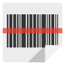
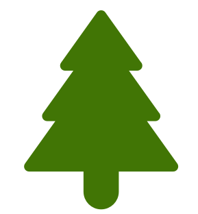
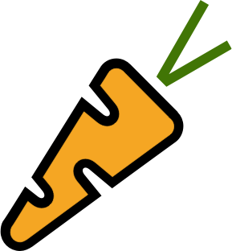
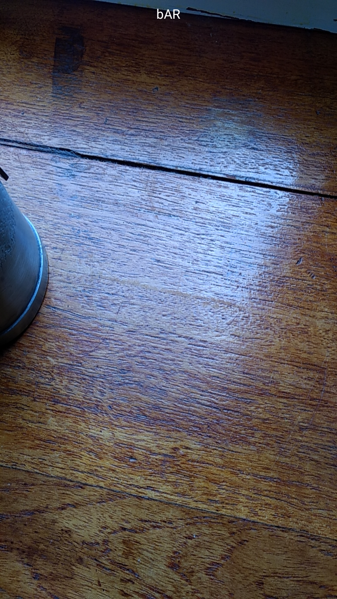
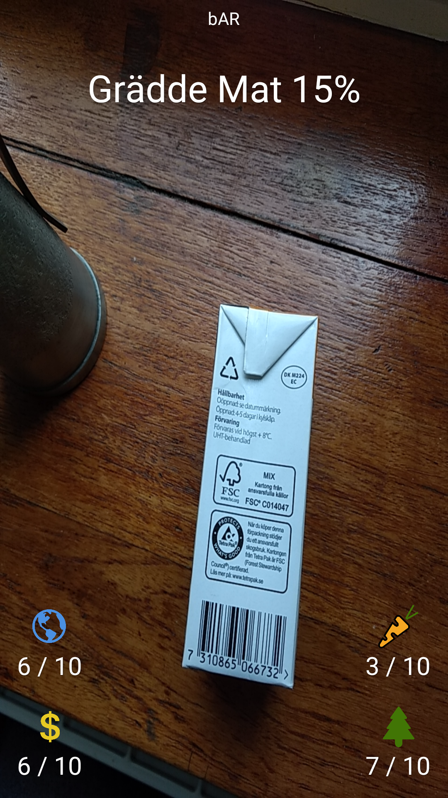
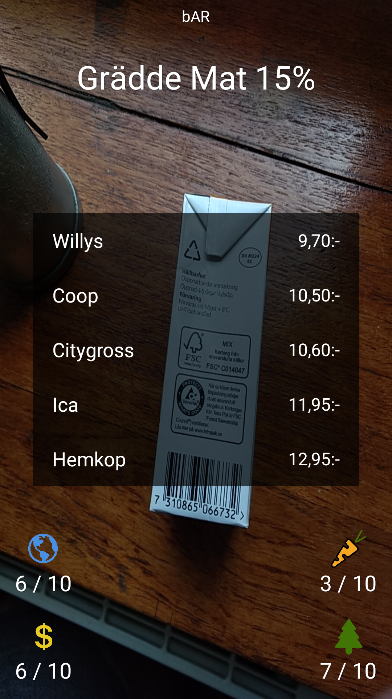

# bAR 
Barcode scanning with Augmented Reality.

bAR scans the enviroment using the camera and will display details of the products in its view. The information is compiled into four major sections: environmental impact , social impact , pricing , and nutrional value .

## About
This project was created for Gothenburg Startup Hack the 6th of May 2017 and won the Jury's award and the Peoples' award.

## Development
* Native Android application
* Camera view using the new camera2 Google API
* Barcode scanning using Google Vision API
* API calls using [Square Retrofit](http://square.github.io/retrofit/)
* Augmented Reality effects using Android layout overlays

## Contributors
| Name         		|
| ----------------- |
| John Johansson    |
| Joakim Berntsson  |
| Simon Arneson 	|

## Screenshots
The screenshots below are of the three states of the application: startup, scanning, and price list.

### Startup

### Scanning

### Price list

